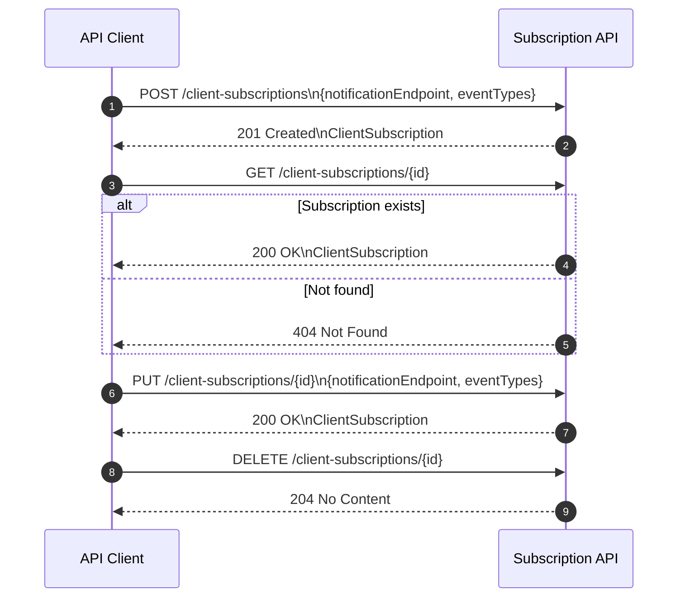

# Client Subscriptions API

This API manages **client subscriptions** as standalone resources.  
There are **no sub-resources**.  
Each subscription defines:

- `notificationEndpoint` → wraps the webhook URL  
- `eventTypes` → array of supported event types  
- Metadata (`clientSubscriptionId`, `createdAt`, `updatedAt`)  

---

# 🔐 Authentication
All endpoints require JWT:

```
Authorization: Bearer <JWT>
```

---

# Sequence diagrams


# 🚀 Endpoints

## Client Subscriptions API – Endpoint Summary

| Method | Endpoint | Request Body | Response | Description |
|--------|----------|--------------|----------|-------------|
| **POST** | `/clientSubscriptions` | `ClientSubscriptionRequest` | `ClientSubscription` | Creates a new subscription. Returns the full subscription object including ID and timestamps. |
| **GET** | `/clientSubscriptions/{clientSubscriptionId}` | _None_ | `ClientSubscription` | Retrieves a subscription by its unique ID. |
| **PUT** | `/clientSubscriptions/{clientSubscriptionId}` | `ClientSubscriptionRequest` | `ClientSubscription` | **Strict update** — replaces `notificationEndpoint` and `eventTypes` entirely. |
| **DELETE** | `/clientSubscriptions/{clientSubscriptionId}` | _None_ | `204 No Content` | Deletes the subscription identified by `clientSubscriptionId`. |


## Create Subscription  
### `POST /clientSubscriptions`

**Request Body**
```json
{
  "notificationEndpoint": {
    "webhookUrl": "https://example.com/callback"
  },
  "eventTypes": ["PCR", "CUSTODIAL_RESULT"]
}
```

**Response (201 Created)**
```json
{
  "clientSubscriptionId": "uuid",
  "notificationEndpoint": {
    "webhookUrl": "https://example.com/callback"
  },
  "eventTypes": ["PCR", "CUSTODIAL_RESULT"],
  "createdAt": "2025-01-01T10:00:00Z"
}
```

---

## Retrieve Subscription  
### `GET /clientSubscriptions/{clientSubscriptionId}`

Returns one subscription object.

---

## Update Subscription (Strict PUT)  
### `PUT /clientSubscriptions/{clientSubscriptionId}`

PUT must include **all fields**:
```json
{
  "notificationEndpoint": {
    "webhookUrl": "https://new.example.com/callback"
  },
  "eventTypes": ["PCR"]
}
```

---

## Delete Subscription  
### `DELETE /clientSubscriptions/{clientSubscriptionId}`

Deletes the subscription.

---
